# kottans-frontend

- [X] [Git Basics](#git-basics)
- [X] [Linux CLI, and HTTP](#linux-cli-and-http)
- [X] [Git Collaboration](#git-collaboration)
- [X] [Intro to HTML and CSS](#intro-to-html-and-css)
- [X] [Responsive Web Design](#responsive-web-design)
- [X] [HTML & CSS practice](#html-and-css-practice)
- [X] [JavaScript Basics](#javascript-basics)
- [X] [Document Object Model](#document-object-model)
- [X] [Building a Tiny JS World](#building-a-tiny-js-world)
- [X] [Object-Oriented JavaScript](#object-oriented-javascript)
- [X] [OOP exercise](#oop-exercise)
- [X] [Offline Web Applications ](#offline-web-applications)
- [X] [Memory Pair Game](#memory-pair-game)
- [X] [Website Performance Optimization](#website-performance-optimization)
- [ ] [Friends App](#friends-app) 

---

## [Git Basics](https://github.com/kottans/frontend/blob/master/tasks/git-intro.md)

### What was learned:
- [x] Free video course [Version Control with Git](https://www.udacity.com/course/version-control-with-git--ud123) on Udacity.
- [x] Practice cource [Learn Git Branching](https://learngitbranching.js.org/). It was just like a game!

I bookmarked this one [Git Cheat Sheets](https://training.github.com/downloads/github-git-cheat-sheet/) because I hope it can help me in the future for sure. 

[What is Markdown?](https://github.com/andrewklmn/markdown-portfolio/issues/1) is great tutorial about how to use Markdown on Github.

### My impressions:
I have been using git and github for my home projects just as a remote backup system for long period. 
But now I figured out one thing. When you meet your new working team, you have to ask one 
important question: 

**What do you prefer, guys? Merge or rebase?**

---

## [Linux CLI, and HTTP](https://github.com/kottans/frontend/blob/master/tasks/linux-cli-http.md)

  

    Screenshot of quizzes
  

  
  

### What was new: 

Possibility to print something right from console was really new for me. 

### What surprised me: 

The same as the new one... 

### What I'm going to use in future:

Hmmm... I use console commands every day on my Linux laptop for different administrative tasks, for git, for ssh remote control...
So I'm going to use all of these commands as long as I could... next 50 years at least, I hope... )))))

### Some summary about my HTTP knowledge:
Of course, I have used GET and POST requests in my project. But now I want to have a task in the future where I can use PUT, DELETE, HEAD, and OPTION... 

---

## [Git Collaboration](https://classroom.udacity.com/courses/ud456)

I have used one new piece of knowledge about collaboration work during those lessons. 
I have fetched from upstream repository new commits to my local repository and have rebased and pushed to my fork on Github. It brought my fork to the upstream actual state with console commands just in my local repo! This is amazing! )))

I was surprised that Github Pull Request workflow is so useful, simple, and comfortable for making changes in my pull request to kottans/mock-repo.

---

## [Intro to HTML and CSS](https://github.com/kottans/frontend/blob/master/tasks/html-css-intro.md)

>"Repetition is the mother of mastery."
>*&copy; John Doe*

  

    Screenshot of Udacity HTML CSS Intro Course
  

  
  [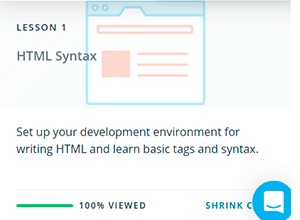](https://www.udacity.com/course/intro-to-html-and-css--ud304)

And this one from Codecademy Learn HTML Course:

[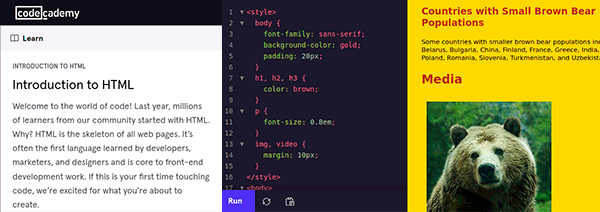](https://www.codecademy.com/learn/learn-html)

These short courses are a great reminder about the roots of Front-end Web Development. It is impossible to do something in this sphere without these basic pieces of knowledge.

By the way, optional materials are a little more exciting: [https://www.freecodecamp.org/andrewklmn](https://www.freecodecamp.org/andrewklmn)

---

## [Responsive Web Design](https://github.com/kottans/frontend/blob/master/tasks/html-css-responsive.md)

- [x] [Responsive Web Design Fundamentals](https://www.udacity.com/course/responsive-web-design-fundamentals--ud893) on Udacity.
- [x] [Flexbox Froggy](http://flexboxfroggy.com/)
- [x] [Grid Garden](http://cssgridgarden.com/)

[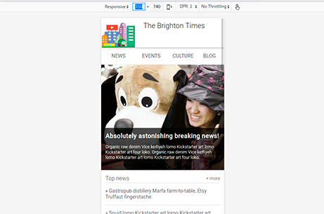](https://www.udacity.com/course/responsive-web-design-fundamentals--ud893)

[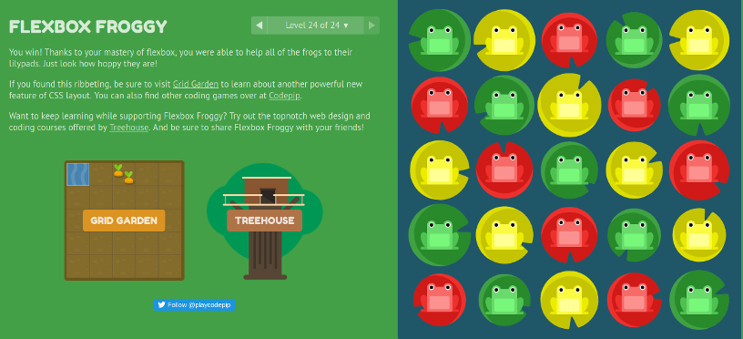](http://flexboxfroggy.com/)

[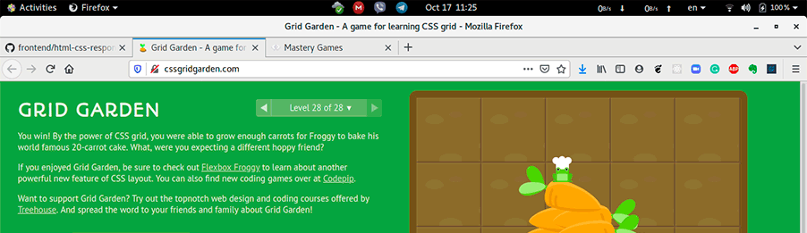](http://cssgridgarden.com/)

### What was new: 

Udacity course has clarified for me the situation with responsive web design using CSS at last. No more Bootstrap magic!

### What surprised me: 

I have used Bootstrap in my projects for responsive pages, but now I can do this stuff even without Bootstrap!

### What I'm going to use in future:

Breakpoint selection, media queries, responsive tables, grid and flexbox - I have all of them in my toolbox now.

---

## [HTML and CSS practice](https://github.com/kottans/frontend/blob/master/tasks/html-css-popup.md)

This task was developed without JS. And was tested in FF and Google Chrome (Linux and Windows both).

[Demo is here](https://andrewklmn.github.io/html-css-popup/)

[Code is here](https://github.com/andrewklmn/andrewklmn.github.io/tree/master/html-css-popup)

---

## [JavaScript Basics](https://github.com/kottans/frontend/blob/master/tasks/js-basics.md)

[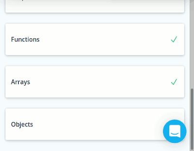](https://www.udacity.com/course/intro-to-javascript--ud803)

[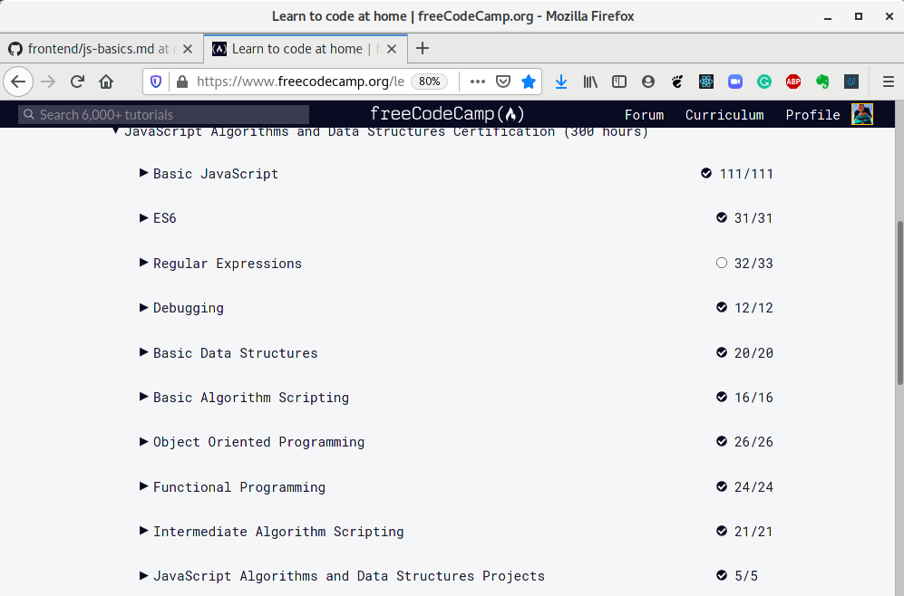](https://www.freecodecamp.org/andrewklmn)

I like [freecodecamp.org](http://freecodecamp.org) very much and even have earned few certificates:
- [Responsive Web Design](https://www.freecodecamp.org/certification/andrewklmn/responsive-web-design)
- [JavaScript Algorithms and Data Structures](https://www.freecodecamp.org/certification/andrewklmn/javascript-algorithms-and-data-structures)
- [Data Visualization](https://www.freecodecamp.org/certification/andrewklmn/data-visualization)
- [Front End Libraries](https://www.freecodecamp.org/certification/andrewklmn/front-end-libraries)

There are my study projects from these courses on Codepen.io: [https://codepen.io/andrewklmn/](https://codepen.io/andrewklmn/)

I feel ready to write code now!... ))) 

---

## [Document Object Model](https://github.com/kottans/frontend/blob/master/tasks/js-dom.md)

[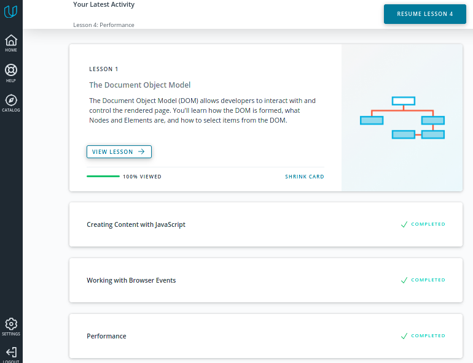](https://classroom.udacity.com/courses/ud117)

[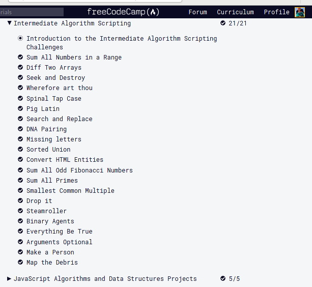](https://learn.freecodecamp.org/javascript-algorithms-and-data-structures/intermediate-algorithm-scripting)

### What was new: 
- Phases of JavaScript Event · Capturing, Target, and Bubbling.
- classList methods:
   - classList. add/remove("class") – adds/removes the class.
   - classList. toggle("class") – adds the class if it doesn't exist, otherwise removes it.
   - classList. contains("class") – checks for the given class, returns true/false .
    
### What surprised me: 
document.querySelector(), document.querySelectorAll() - these are just cool stuff.
I don't need Jquery anymore! )))

### What I'm going to use in future:
All of these things above.

### Some summary about DOM knowledge:
I have used this new stuff in my [practice project](https://github.com/kottans/frontend-2021-homeworks/tree/main/submissions/andrewklmn/task_js_dom).
DOM knowledge helps to write simple clean code.

---

### [Building a Tiny JS World](https://github.com/kottans/frontend/blob/master/tasks/js-pre-oop.md)

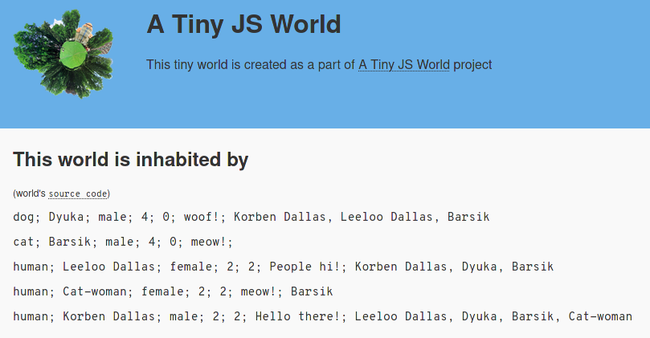

[Demo is here](https://andrewklmn.github.io/a-tiny-JS-world/)

[Code is here](https://github.com/kottans/frontend-2021-homeworks/blob/main/submissions/andrewklmn/a-tiny-js-world/index.js)

---

### [Object-Oriented JavaScript](https://github.com/kottans/frontend/blob/master/tasks/js-oop.md)

[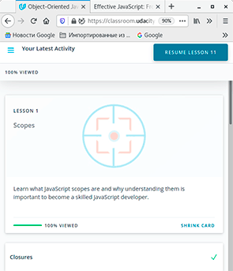](https://classroom.udacity.com/courses/ud015)

[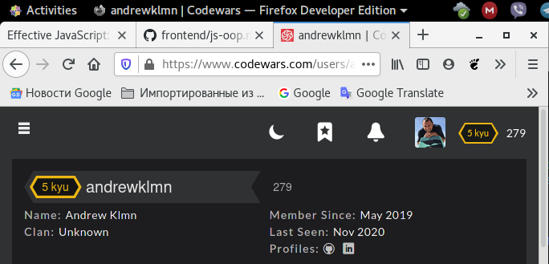](https://www.codewars.com/users/andrewklmn)

### What was new: 
Possibility of class definition and usage just with functional mechanism. 

### What surprised me: 
JS allows to implement inheritance with a functional mechanism. It looks very cool!
Prototype chains in case with methods looks similar to virtual functions in C++. I didn't wait to face it in JS.

### What I'm going to use in future:
I have used these new pieces of knowledge in my practice task Frogger Game.
My [task code](https://github.com/kottans/frontend-2021-homeworks/pull/67) looks very short, laconic and clear with it.

---

### [OOP exercise](https://github.com/kottans/frontend/blob/master/tasks/js-post-oop.md)

[Demo is here](https://andrewklmn.github.io/a-tiny-JS-world/)

[Code is here](https://github.com/andrewklmn/frontend-2021-homeworks/blob/main/submissions/andrewklmn/a-tiny-js-world/index.js)

[PR is here](https://github.com/kottans/frontend-2021-homeworks/pull/72)

It was first usage of my new experience with definition of classes with functional mechanism from previous task. 
But at the end, at suggestion of mentors, I refactored  my code with ES6 classes. ))))

---

### [Offline Web Applications](https://github.com/kottans/frontend/blob/master/tasks/app-design-offline.md)

[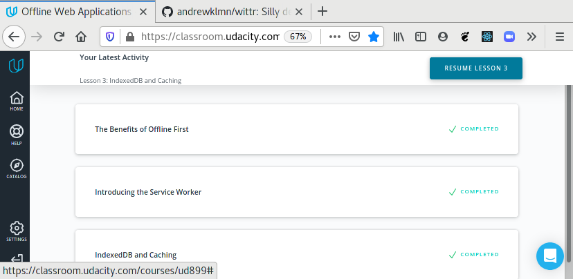](https://www.udacity.com/course/offline-web-applications--ud899)

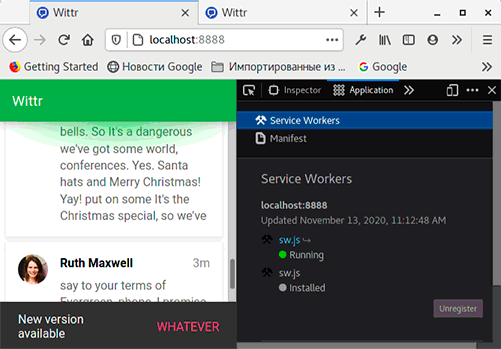

### What was new:
Service Workers, IndexedDB, Advanced using of the cache.

### What surprised me:
Nowadays modern browsers let developers build offline web applications with a wide range of storage usage.
Service Workers can control even the versions of CSS files on the browser site.
So it seems like a full range of backend features in the browser just under the hood.
It is possible to build a web app that can run without any interaction with networks after first loading from a remote site.

### What I'm going to use in the future:
I have forked wittr project to my Github profile. And I'm going to use it as a workbook in the future.
I'm going to rebuild one of my home projects as an offline app with these new pieces of knowledge.

---

### [Memory Pair Game](https://github.com/andrewklmn/frontend/blob/master/tasks/memory-pair-game.md)

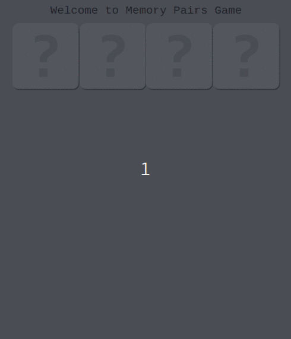

[Demo is here](https://andrewklmn.github.io/memory-pair-game/)

[Code is here](https://github.com/kottans/frontend-2021-homeworks/tree/main/submissions/andrewklmn/memory-pair-game)

[PR is here](https://github.com/kottans/frontend-2021-homeworks/pull/101)

Special thanks to MadmaxWMFU! )))

---

### [Website Performance Optimization](https://github.com/kottans/frontend/blob/master/tasks/app-design-performance.md)

#### Website Performance Optimization, Udacity Course by Google:

[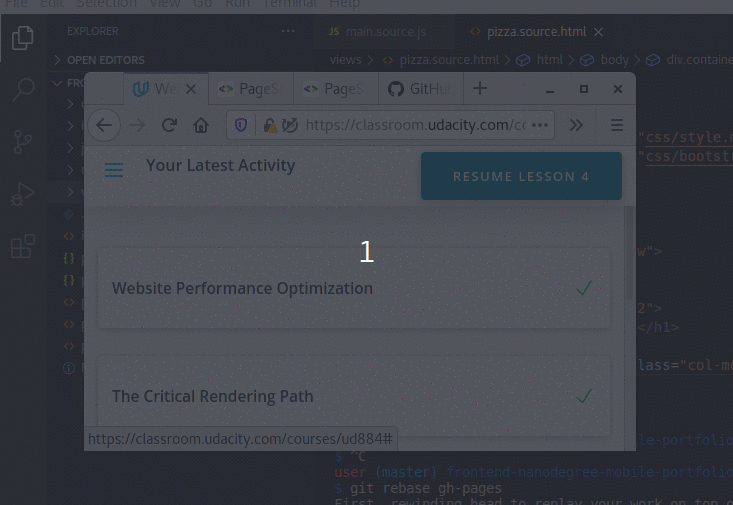](https://www.udacity.com/course/ud884)

  

    Screenshot of Pizza web app Pagespeed Insights index before and after optimization.
  

  
  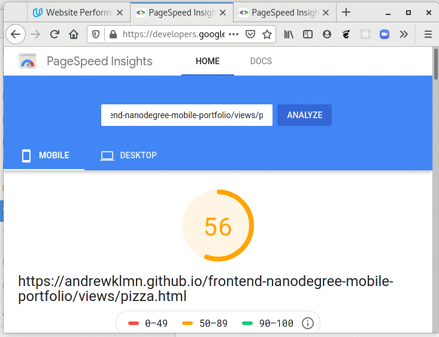
  

  

    Mistakes and strange result in Udacity Browser Rendering Optimization Course.
  

  ##### That code can't get that result!

  [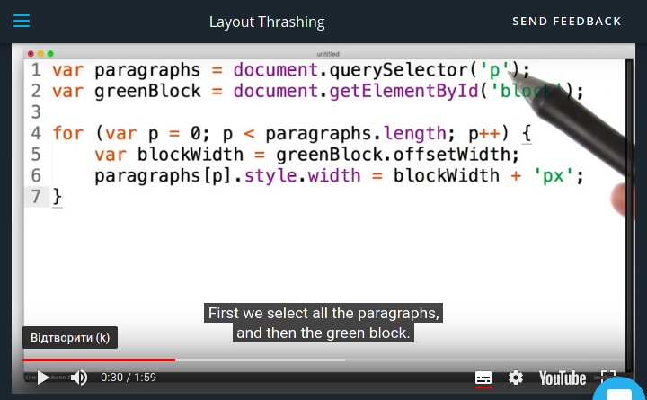](https://classroom.udacity.com/courses/ud860/lessons/4147498575/concepts/41331086040923)
  
  Of course it must be querySelectorAll('p')... 

  ##### Example of Udacity optimization solution slows down the browser!

  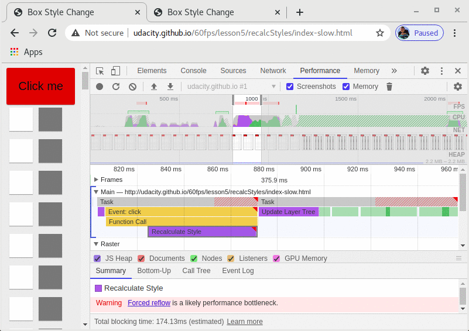
  
  May be it's because this example is 6 years old. It seems like new browsers have better optimization mechanism.

---

#### Browser Rendering Optimization, Udacity Course by Google:

[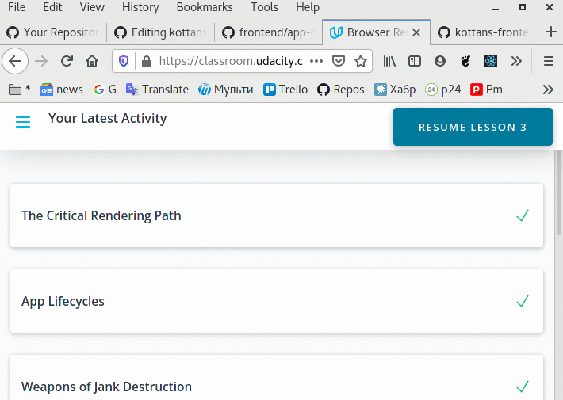](https://classroom.udacity.com/courses/ud860)

  

    Screenshot of optimized projects.
  

  
   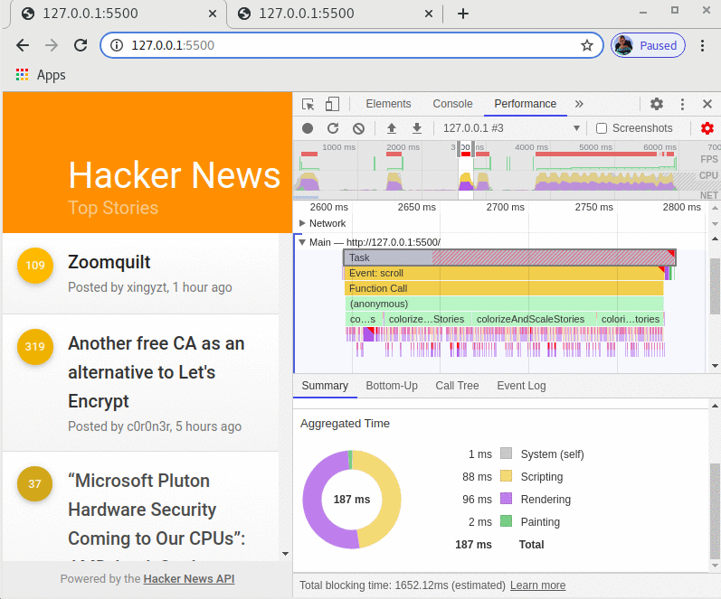
   

---

#### Responsive Images, Udacity Course by Google:

[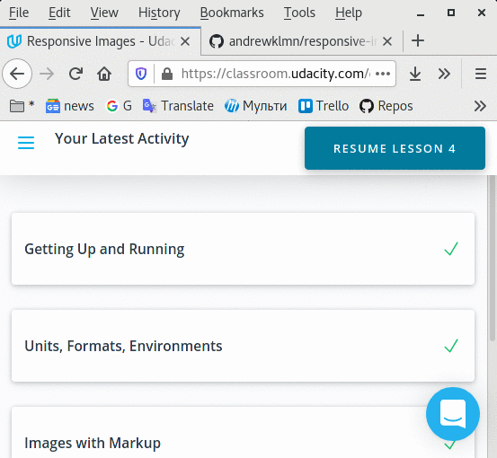](https://classroom.udacity.com/courses/ud882)

  

    Screenshot of responsive images project.
  

  
  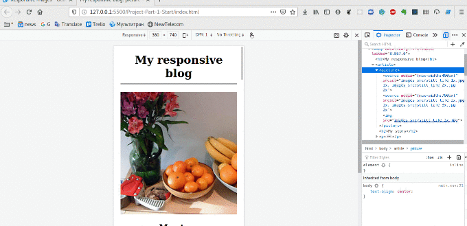
  

  
# 🐈 🐈 🐈 🐈 🐈 🐈 🐈 🐈 🐈 🐈

### What was new:
DevTools Profiler with timeline, Render pipeline in the browser, requestAnimationFrame(), Web workers.

### What surprised me:
Web workers are just like goroutines in Golang or threads in C. I didn't think to face it in the browser's JS.
When I was trying to use 'for' loop for the time delay in web worker I was surprised that only a number of loops up to [20000000](https://github.com/andrewklmn/web-worker-test/tree/master) can make a tiny delay that I can identify with my eyes. Browser's JS engine is really very fast. But for 60 fps animations, we have only 12ms for changing the image on the screen with JS.

### What I'm going to use in the future:
This Website Performance Optimization section is the first time when I read about the performance and timing diagrams in JS.
Now I understand how I can use it, where I can find bottlenecks of performance... So I think every new project of mine will be checked and improved with these technics in the future.

---

### [Friends App](https://github.com/andrewklmn/frontend/blob/master/tasks/friends-app.md)

...coming soon... )))
